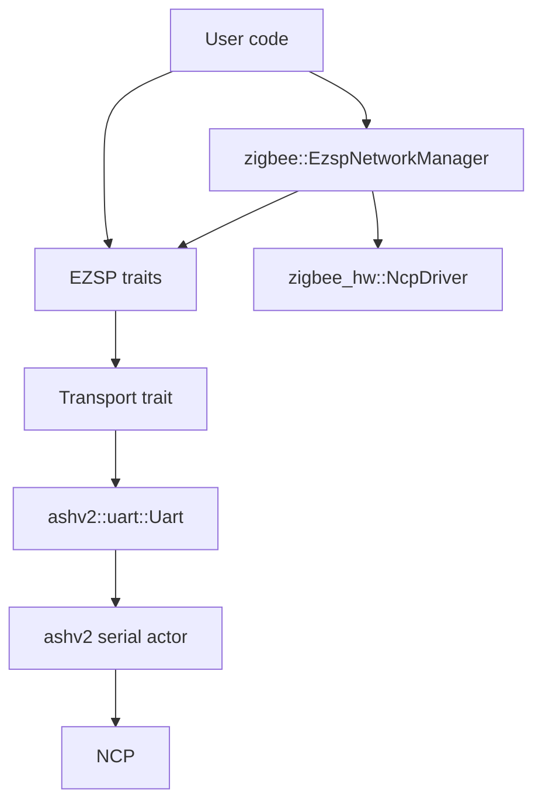
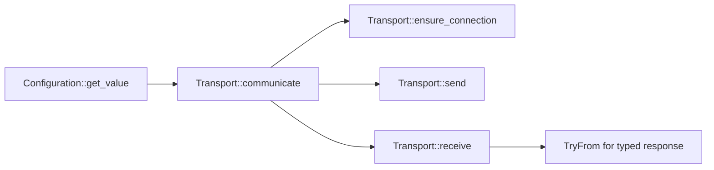
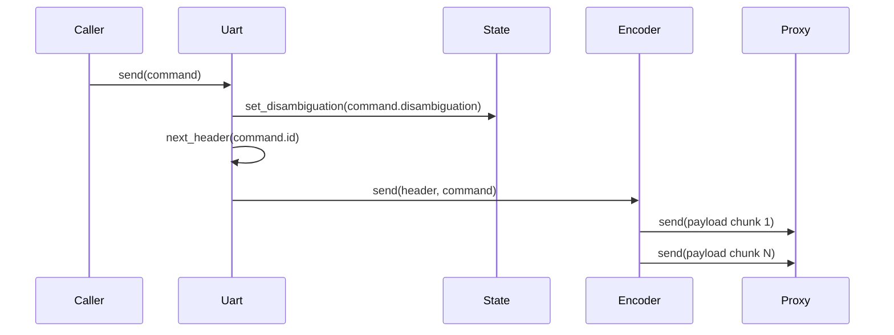
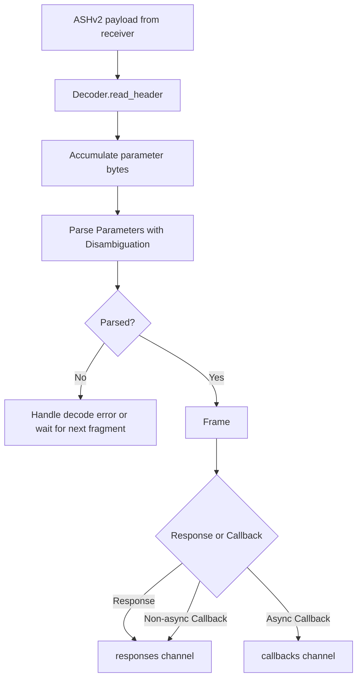
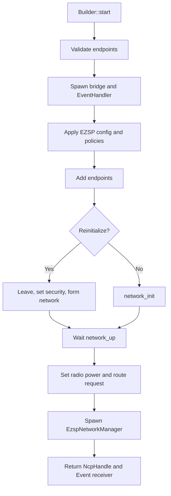
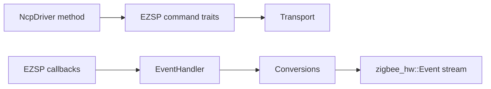

# Architecture

This document describes the internal architecture of the `ezsp` crate as currently implemented.

## High-Level Structure

The crate is split into three major layers:

1. Core protocol layer (always available):
   - EZSP command traits
   - frame/header/parameter encoding and decoding
   - shared error/result/types
   - transport abstraction
2. `ashv2` transport layer (`feature = "ashv2"`):
   - concrete serial transport implementation (`uart::Uart`)
   - connection lifecycle, protocol negotiation, TX/RX pipelines
3. Zigbee integration layer (`feature = "zigbee"`):
   - `zigbee_hw` driver integration (`zigbee::EzspNetworkManager`)
   - callback-to-event translation
   - network bootstrap/orchestration builder

## Core Library Architecture (Always Enabled)

### Public API Surface

`src/lib.rs` re-exports the primary protocol API:

- Command traits: `Configuration`, `Messaging`, `Networking`, `Security`, `Utilities`, etc.
- Super-trait: `Ezsp`
- Transport abstraction: `Transport`
- Frame model: `Frame`, `Header`, `Parameters`, `Response`, `Callback`, etc.
- Extension traits: `ConfigurationExt`, `PolicyExt`, `Displayable`

### Trait Composition: `Transport` + Command Traits

The central architectural decision is that all command traits are blanket-implemented for any `T: Transport`.

- `Transport` defines the low-level async communication primitives:
  - `ensure_connection()`
  - `send(command)`
  - `receive::<R>()`
  - default `communicate::<C, R>()` (`ensure_connection` -> `send` -> `receive`)
- Command traits (for example `Configuration`, `Messaging`, `Networking`) are high-level typed facades.
- Each command method builds a typed command parameter object and calls `self.communicate::<_, ResponseType>(...)`.
- Responses are converted into domain types through `TryFrom<Parameters>` / `TryInto<_>`.

This creates a strict layering:

1. Transport handles bytes/frame transport concerns.
2. Command traits handle protocol semantics and typing.
3. Callers only depend on typed command traits, not raw frame parsing.

### `Ezsp` Super-Trait

`Ezsp` combines all command traits and adds connection/version lifecycle methods:

- `init()` for protocol version negotiation
- `negotiated_version()` as state exposure

In practice, a transport implementation (for example `Uart`) implements `Ezsp`, while command traits become available via blanket impls from `Transport`.

### Frame and Parameter Model

The frame subsystem (`src/frame`) provides typed parsing and framing:

- `Header` can be `Legacy` or `Extended`.
- `Parameters` discriminates protocol payload into `Response` or `Callback`.
- `Parameter` trait is implemented by outgoing command parameter types.
- `Parsable` trait drives inbound parsing from little-endian streams.

The parser also uses `Disambiguation` to resolve ambiguous callback/response IDs where protocol context is required.

### Extension Traits

The core extension traits build convenience APIs on top of base command traits:

- `ConfigurationExt` iterates all configuration IDs and gathers supported values.
- `PolicyExt` iterates all policy IDs and gathers supported values.
- `GetValueExt` provides typed convenience (`get_ember_version`).
- `Displayable` wraps maps into printable adapters for diagnostics/logging.

These are additive and do not alter transport semantics.

### Error Topology

`Error` is the single crate-level error type and unifies:

- transport I/O (`Error::Io`)
- decode failures (`Error::Decode`)
- protocol status failures (`Error::Status`)
- value conversion failures (`Error::ValueError`)
- protocol/flow-specific failures (`InvalidCommand`, `ProtocolVersionMismatch`, etc.)

Because command traits all return `Result<_, Error>`, failures propagate consistently across all layers.

## `ashv2` Feature Architecture

This section documents the code gated behind `feature = "ashv2"` (`src/uart`).

### Purpose

`uart::Uart` is the concrete transport implementation for EZSP over ASHv2 serial framing.
It is currently the only transport implementation provided by this crate.

### Main Components

- `Uart`: owns protocol state and implements `Transport` and `Ezsp`.
- `Encoder`: serializes EZSP header + parameters into ASHv2 payload chunks and sends via `ashv2::Proxy`.
- `Decoder`: incrementally decodes ASHv2 payloads into typed EZSP `Frame` values, including fragmented frame assembly.
- `Splitter`: routes decoded frames into:
  - response queue for request/response flow
  - callback queue for async callbacks
- `State` + `Connection`: shared mutable transport state:
  - connection state (`Disconnected`/`Connected`/`Failed`)
  - negotiated protocol version
  - active `Disambiguation`
- `NpRwLock`: non-poisoning lock wrapper used for shared state access.

### Connection and Version Negotiation

On first command (or after failure), `Transport::ensure_connection()` triggers `Ezsp::init()`.

`Uart::init()` calls `negotiate_version()`:

1. send `version(desired)` in legacy format
2. store negotiated version
3. if negotiated version supports extended frames, renegotiate in non-legacy mode
4. require exact match with desired version, otherwise fail with `ProtocolVersionMismatch`

State transitions are tracked in `State::connection`.

### TX Path (Command Send)

`Uart::send` flow:

1. Build next EZSP header (`Legacy` or `Extended`) from current state.
2. Store command `Disambiguation` in shared state before sending.
3. `Encoder` serializes header + parameter bytes.
4. Large payload is chunked into ASHv2 max payload fragments.
5. Fragments are sent through `ashv2::Proxy`.

### RX Path (Decode and Routing)

A background `Splitter` task is spawned in `Uart::new`.

1. `Decoder` receives ASHv2 payloads.
2. Header is parsed as legacy or extended depending on negotiated state.
3. Parameter bytes are accumulated across fragments if needed.
4. `Parameters::parse_from_le_stream(...)` uses current `Disambiguation`.
5. Parsed `Frame` is routed by `Splitter`:
   - response -> response queue
   - async callback -> callback queue
   - non-async callback -> response queue

On decode errors, if a response is pending, the error is forwarded into the response queue.

### Response Matching Strategy

`Uart::receive::<T>` reads from the shared response queue and attempts `T::try_from(Parameters)`.

- On success: returns the typed response.
- On type mismatch: re-queues the received parameters and retries after a short grace period.

This strategy allows interleaved response traffic while preserving typed command APIs.

### ASHv2 Construction APIs

- `Uart::from_serial_port(...)` builds the ASHv2 actor and returns:
  - `Uart`
  - ASHv2 tasks handle
  - EZSP callback receiver
- `Uart::open(path, flow_control, ...)` is a path-based convenience wrapper.
- `ChannelSizes` and `Buffers` provide channel sizing controls for runtime behavior tuning.

## `zigbee` Feature Architecture

This section documents `feature = "zigbee"` internals (`src/zigbee`).

### Goal

The Zigbee layer adapts EZSP command/callback mechanics to the `zigbee_hw` runtime model by:

- implementing `zigbee_hw::NcpDriver` for `EzspNetworkManager<T>`
- translating EZSP callbacks into `zigbee_hw::Event`
- providing a `Start`-capable builder for network bootstrap

### Main Types and Their Roles

- `zigbee::EzspNetworkManager<T>`:
  - owns EZSP transport
  - tracks protocol-level sequencing (`message_tag`, APS seq, transaction seq)
  - owns proxy channel to event handler actor
  - implements `NcpDriver` for stack operations (scan, send, address lookup, etc.)
- `zigbee::network_manager::Builder<T>`:
  - configuration DSL for policy/config/security/radio options
  - implements `zigbee_hw::Start`
- `EventHandler`:
  - actor implementing `zigbee_hw::EventTranslator`
  - consumes callback messages and emits translated `zigbee_hw::Event`
- `conversion` module:
  - EZSP-to-Zigbee type conversions (found networks, scanned channels, trust-center join, APS frame parsing)

### Trait Coupling

`EzspNetworkManager<T>` implements `NcpDriver` only if `T` supports the required EZSP command traits:

- `Configuration + Security + Messaging + Networking + Utilities + Send + Sync`

This keeps Zigbee integration transport-agnostic while still requiring the exact EZSP capabilities needed by the driver.

`Builder<T>` implements `Start` for `T: Transport + Sync + 'static`, because startup requires issuing raw EZSP setup commands and spawning async tasks.

### Startup Flow (`Builder::start`)

`Builder::start(endpoints)` performs orchestrated bootstrap:

1. validate endpoints
2. create internal channels
3. spawn callback bridge and event translator actor
4. apply concentrator, configuration, and policy settings via EZSP commands
5. register endpoints via EZSP `add_endpoint`
6. optionally reinitialize network:
   - leave network
   - set initial security state
   - form network
   else call `network_init`
7. wait for `network_up` event
8. apply runtime radio settings and route request
9. spawn `EzspNetworkManager` actor and return `NcpHandle` + event stream

### Callback Translation

EZSP callbacks are translated by `EventHandler`:

- Networking callbacks:
  - stack status -> network up/down events
  - network/energy scan results -> buffered scan results
  - scan complete -> flush buffered result set to waiting request
- Messaging callbacks:
  - incoming message -> APS decode -> `Event::MessageReceived`
  - message sent -> ACK diagnostics/logging
- Trust center/security callbacks:
  - translated when supported, logged otherwise

APS defragmentation is no longer handled in this crate and is now handled by `zigbee-coorinator`.

### Request/Response vs Event Planes

The Zigbee integration separates two data planes:

1. Command plane (`NcpDriver` methods): direct EZSP calls over transport.
2. Event plane (`EventHandler`): asynchronous callback stream converted to `zigbee_hw::Event`.

This split keeps command latency and callback handling decoupled while still synchronized via shared channels and scan subscriptions.

## Notes on Feature Gating

- Core protocol layer is always compiled.
- `ashv2` module is compiled only with `feature = "ashv2"`.
- `zigbee` module is compiled only with `feature = "zigbee"`.
- Some Zigbee convenience constructors additionally require both (`zigbee` + `ashv2`), for example `EzspNetworkManager::ashv2(...)`.

This keeps the crate usable both as a pure protocol library and as a full Zigbee NCP host stack.
