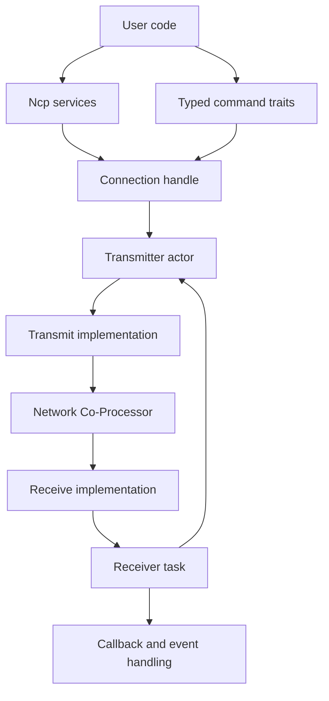
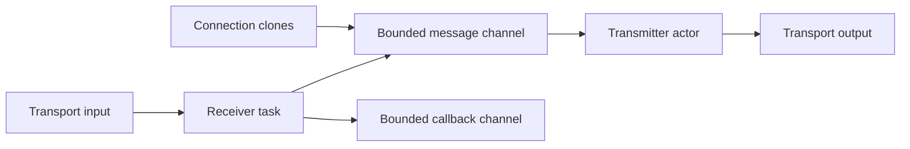
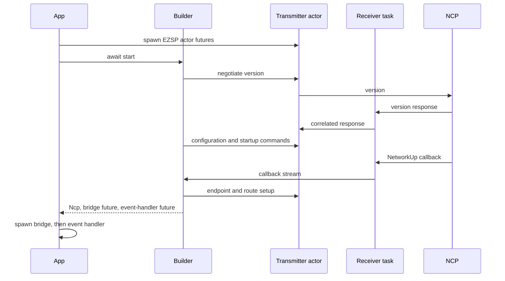
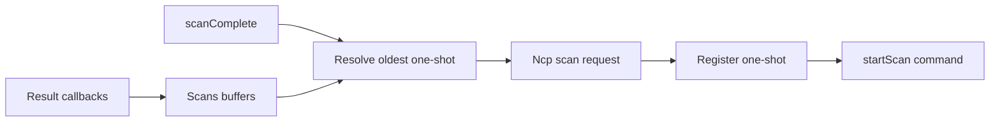
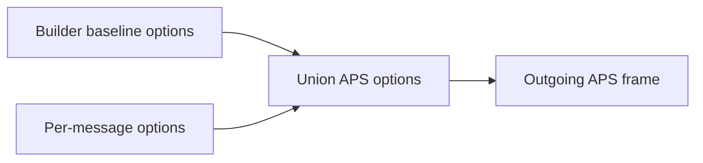
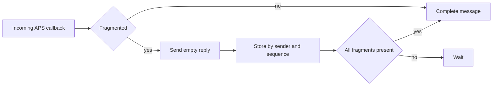
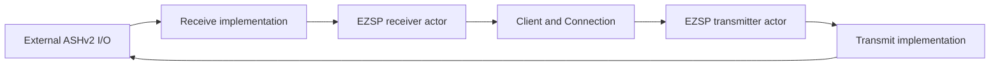
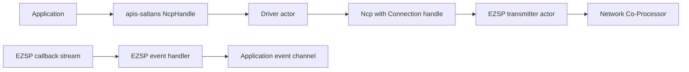
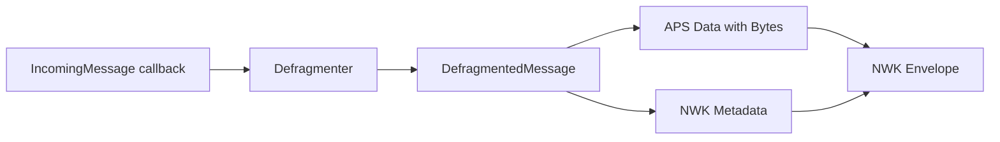

# Architecture

This document describes the actor-based architecture of the `ezsp` crate for
contributors.

## Layering

The crate has four cooperating layers:

1. Protocol model
   - EZSP legacy and extended headers
   - typed command, response, and callback parameters
   - Ember and EZSP data types
2. Transport actors
   - transport-specific `Transmit` and `Receive` traits
   - transmitter actor, receiver task, lifecycle handles, and callback routing
   - typed command traits built on `Communicate`
3. NCP services
   - startup builder and network lifecycle
   - endpoint metadata, scans, APS messaging, defragmentation, and event handling
4. Optional integrations
   - external transports, such as ASHv2, through `Transmit` and `Receive`
   - `apis-saltans` driver and event conversions

## Protocol model

`src/frame` owns the wire envelope and aggregate parameter types:

- `Header` selects `Legacy` or `Extended` framing.
- Legacy headers are three bytes and support one-byte frame IDs.
- Extended headers are five bytes and support two-byte frame IDs.
- `Frame<T>` combines a header with typed parameters.
- Outbound command parameter structs convert into the aggregate `Commands`
  enum used by the transmit actor.
- Inbound payloads parse into `Parameters::Response` or
  `Parameters::Callback` according to the frame ID.

Parameter parsing is ID-driven through
`Parameters::parse_from_le_stream(id, stream)`. Each command group has a public
trait under `src/commands` and matching wire parameter modules under
`src/frame/parameters`. A command-trait method constructs the relevant command
payload, calls `Communicate::communicate`, and converts the typed response.

`Ezsp` combines all command-group traits without adding methods or lifecycle
state.

## Transport actor system

### Transport boundary

The actor layer deliberately separates output from input:

- `Transmit::transmit` accepts one complete outbound EZSP frame and reports
  encoding or I/O errors.
- `Receive::receive` accepts the actor's current negotiated-version state and
  returns the next decoded inbound EZSP frame.
- `Client::run` is an associated constructor that creates a pre-negotiation
  `Client` and the internal transmitter and receiver futures that drive the
  EZSP actor layer.

This crate supplies no ASHv2 or other physical-transport implementation. The
boundary keeps EZSP transaction logic independent of the link layer and allows
an external transport crate to provide both halves.

### Caller-spawned tasks and channels

`Client::run(transmit, receive, channel_size)` creates the bounded channels and
returns the client together with `Futures`, exported from the crate root. The
caller spawns its fields as Tokio tasks:

1. `Futures::transmitter` owns the `Transmit` implementation and the actor inbox.
2. `Futures::receiver` owns the `Receive` implementation, sends responses back
   to the actor inbox, and sends asynchronous callbacks to the callback channel.

The message-channel capacity bounds both commands from connected handles and
responses forwarded by the receiver. The callback-channel capacity independently
bounds asynchronous callback buffering. Backpressure is therefore applied at
both boundaries.

### Lifecycle states

The channel endpoints form a `Client` handle before negotiation.
`Client::connect` sends an internal `Connect` message containing the
desired nonzero protocol version and a one-shot reply. Its actor futures must
already be running; `connect` does not spawn them.

The transmitter sends `version` using a legacy-compatible header. The generic
receiver actor initially calls `Receive::receive(None)`, records the protocol
version when it observes the decoded response, passes `Some(version)` to
subsequent receive calls, and forwards the response to the transmitter. A
matching version completes the one-shot request and produces:

- `Connection`, a cloneable sender-backed command handle; and
- the receiver of asynchronous `Callback` values.

The type transition prevents normal command methods from being called through
the standard API before negotiation succeeds. The caller owns the spawned task
handles and therefore also owns shutdown and failure handling.

### Command and response correlation

`Connection::communicate` converts a typed command into `Commands`, sends an
internal `Command` message, and awaits a dedicated one-shot channel. The
transmitter actor:

1. chooses legacy or extended framing from the negotiated version;
2. builds a header with the next wrapping sequence number and the command ID;
3. rejects the command if that sequence number is still occupied;
4. transmits the frame;
5. stores the response sender by sequence number; and
6. completes it when the receiver forwards the matching response frame.

The sequence map supports concurrent in-flight requests from cloned `Connection`
handles. It also prevents a wrapped sequence number from replacing an existing
request; collision returns `Error::TransactionQueueFull`.

The receiver routes payloads as follows:

- responses go to the transmitter actor;
- asynchronous callbacks go to the callback channel; and
- non-asynchronous callbacks go to the transmitter actor because some EZSP
  commands return callback-shaped payloads synchronously.

The actor only transports aggregate parameters. `Connection::communicate`
performs the final conversion into the response type declared by
`RespondsWith`; a mismatched payload becomes `Error::UnexpectedResponse`.

## High-level NCP services

### Builder ownership and startup

`Builder` owns a pre-negotiation `Client` and startup configuration:

- the callback-to-event-handler message capacity;
- desired EZSP protocol version;
- configuration and policy maps;
- optional concentrator parameters;
- radio transmit power; and
- baseline APS route-discovery and address options used for outgoing frames.

The builder exposes named methods for each supported baseline option. It moves
the resulting bit set into `Ncp` during construction; individual send calls
then supply any message-specific APS options.

`Builder::start(startup, endpoints, events)` requires a nonempty endpoint list
and an event type implementing `TranslatableEvent`. The current startup sequence
is:

1. require the caller to have spawned all transport actors;
2. negotiate the desired protocol version;
3. set concentrator, configuration, and policy values;
4. query the NCP identity and network state;
5. register every endpoint and construct `Ncp` while the network is down;
6. execute `Startup::Initialize` or `Startup::Resume`;
7. wait for a `NetworkUp` callback;
8. set runtime radio power and log current stack/security state;
9. issue the many-to-one route request;
10. return the callback-to-message bridge future; and
11. return the event-handler future.

`Builder::start` does not spawn tasks. The application must first start any
lower-level transport tasks, then spawn both actor futures returned by
`Client::run`, and only then await `start`. Once startup returns, it must
spawn the callback bridge before the event handler. This preserves dependency
order across bounded channels and avoids waiting on a lower layer that is not
being polled.

`Startup::Resume` calls `network_init` with the selected `InitBitmask`.
`Startup::Initialize` attempts to leave the current network, installs the
initial security state, and forms a network using `InitializationParameters`.
`NetworkCredentials` keeps the extended PAN ID, PAN ID, trust-center identity,
and network key together; the initialization value adds a preconfigured link
key, channel, join method, and initial-security bitmask.

### NCP state and endpoint selection

`Ncp` owns:

- a `Connection` communicator;
- the registered `Endpoint` descriptors;
- a sender to the event handler;
- baseline APS options configured by `Builder`; and
- the next wrapping message tag.

For ordinary APS profiles, source-endpoint selection scans registered endpoints
in stored order and picks the first whose output clusters contain the requested
cluster. ZDP always uses endpoint zero. No match returns
`Error::NoMatchingSourceEndpoint` before transport I/O.

### Scan correlation

An active or energy scan first registers a one-shot sender with the event
handler and then issues `start_scan`. `Scans` queues pending scan kinds and
buffers `networkFound` or `energyScanResult` callbacks. `scanComplete` pops the
oldest pending scan and returns the appropriate buffered results.

### APS sends and deferred confirmation

Unicast, multicast, and broadcast helpers allocate a message tag and register a
one-shot status sender with the event handler before issuing the send command.
The EZSP command response indicates acceptance and, where applicable, supplies
the APS sequence. The later `messageSent` callback resolves the one-shot by tag.

Each helper accepts per-message `ember::aps::Options`. `Ncp::aps_frame` unions
them with the baseline options inherited from `Builder`, so a caller can add
encryption or retry behavior without removing routing or address behavior
selected at startup.

`StackResponse` wraps the one-shot receiver as a future. It succeeds only for
`ember::Status::Success`; stack failures, unknown status bytes, or a dropped
event-handler sender become crate errors. Dropping the future does not cancel an
already accepted APS message.

Unicast payloads larger than `maximumPayloadLength` are split into APS
fragments. The first stack-assigned APS sequence is reused by later fragments,
and all non-final `StackResponse` values are awaited before the final deferred
response is returned. Fragmentation also enables `Options::RETRY` on every
fragment. Multicast and broadcast reject oversized payloads.

### Callback and event handling

The callback bridge converts received `Callback` values into internal NCP
messages. `EventHandler<T, E>` has four responsibilities:

- aggregate scan callbacks;
- correlate `messageSent` callbacks by message tag;
- reassemble incoming APS fragments; and
- convert callbacks and complete incoming messages into `E`.

`TranslatableEvent` is a marker trait with a blanket implementation for types
implementing both `TryFrom<Callback>` and `TryFrom<DefragmentedMessage>`. The
event handler logs conversion failures and stops when it receives `Terminate`
or its inbox closes.

### APS defragmentation

`Defragmenter<T>` owns another clone of the connected communicator. Incoming
fragmented messages are keyed by sender and APS sequence. Each fragment is
acknowledged through an empty `sendReply` before it is stored. The configured
window bounds accepted fragment indexes, the receive-buffer limit bounds the
assembled payload, and `tick` removes expired packets.

## External ASHv2 integration

ASHv2 is an external adapter at the transport boundary; this crate has no
`ashv2` dependency, feature, re-export, UART module, or ASHv2-specific builder
constructor.

The outbound adapter implements `Transmit`. It consumes `Frame<Commands>`,
serializes its `Header` and command payload in little-endian order, and submits
the bytes as one ASHv2 DATA payload. The adapter maps encoding, capacity, and
I/O failures into `crate::Error`.

The inbound adapter implements `Receive`. On each call it obtains a complete
ASHv2 DATA payload and uses the supplied negotiated version to parse `Legacy`
headers before negotiation or `Extended` headers after a sufficiently new
version, then calls
`Parameters::parse_from_le_stream` with the decoded frame ID and remaining
bytes. It should also reject truncated or overflowed response headers and
handle `invalidCommand` responses consistently with the public error model.
Because `Receive::receive` returns `Option<Frame<Parameters>>`, malformed-frame
logging, skipping, and stream-termination policy belong to the adapter.

The generic actor owns the negotiated-version state. It passes `None` to
`Receive::receive` until it recognizes the decoded `version` response, then
passes `Some(version)` on subsequent calls. External ASHv2 tasks must be running
before the two futures returned by `Client::run`; both EZSP futures must be
running before `Builder::start` initiates negotiation.

EZSP and ASHv2 have no frame fragmentation boundary: each complete EZSP frame
must fit in one ASHv2 DATA payload. The external adapter defines how an
oversized encoded frame is reported as `crate::Error`.

## `apis-saltans` integration

The `apis-saltans` feature is implemented under `src/apis_saltans` and adds
traits/conversions without introducing another transport or NCP wrapper.

`Ncp` implements `apis_saltans_hw::Driver`. Driver operations map as follows:

- `get_endpoints` converts the stored `Endpoint` list to `SimpleDescriptor`,
  logging and filtering values with unknown profiles or reserved endpoint IDs;
- `get_pan_id` currently delegates to EZSP `getNodeId`;
- `get_ieee_address` delegates to `getEui64`;
- active and energy scans reuse `Ncp` scan registration and callback
  aggregation;
- `allow_joins` converts the duration to whole seconds, clamps it to `u8::MAX`,
  issues `permitJoining`, and returns the effective duration;
- `route_request` issues a high-RAM many-to-one route request;
- short/IEEE address translation uses EZSP lookup commands; and
- datagram transmission maps destinations to `Ncp::unicast`, `broadcast`, or
  `multicast` and wraps the resulting `StackResponse` in `HwResponse`.

`Builder::start` returns `Ncp` inside a `BuildResult`, rather than an
`NcpHandle`. Calling `Driver::run(channel_size)` creates the separate
`apis-saltans` driver actor and returns its `NcpHandle` plus a future. The
application must spawn that future.

The driver actor serializes hardware API calls. The EZSP transmitter actor below
it serializes wire transmission and correlates sequence-numbered responses. APS
completion is a third asynchronous boundary: `Driver::transmit` returns an
`HwResponse` containing a `StackResponse`, which resolves only after the event
handler receives the matching `messageSent` callback.

### Endpoint conversion

`conversion/endpoint.rs` converts `SimpleDescriptor` into the crate's raw
`Endpoint` representation for `Builder::start`. It copies the endpoint ID,
profile ID, device ID, application flags, and both cluster lists.

The reverse `TryFrom<Endpoint>` validates the raw profile and endpoint number.
`Driver::get_endpoints` clones every stored endpoint, attempts this conversion,
logs failures, and returns only valid descriptors. Values originating from a
`SimpleDescriptor` are expected to round trip.

### Destination mapping and send completion

The driver splits each `Datagram` into metadata and payload. Its profile and
cluster ID become the outgoing APS frame metadata. Its
`Metadata::tx_options()` maps acknowledged transmission to
`ember::aps::Options::RETRY` and APS security to
`ember::aps::Options::ENCRYPTION`; other `TxOptions` flags do not change the
EZSP APS options. Destinations map as follows:

| `apis-saltans` destination | EZSP helper | Destination endpoint | Routing values |
| --- | --- | --- | --- |
| Device | `Ncp::unicast` | Requested device endpoint | Direct short ID |
| Broadcast | `Ncp::broadcast` | Requested broadcast endpoint | Radius zero |
| Group | `Ncp::multicast` | Profile broadcast endpoint | Zero hops and nonmember radius |

In every case, `Ncp` chooses the local source endpoint from registered output
clusters and combines the mapped datagram options with its baseline options.
The immediate driver result means the EZSP send command was accepted; the
`HwResponse` future reports final stack status.

### Callback and incoming-message conversion

`TryFrom<Callback> for apis_saltans_hw::Event` recognizes three callback
families:

- `ChildJoin` becomes `DeviceJoined` or `DeviceLeft` after validating its short
  address;
- successful `StackStatus` becomes `NetworkUp`, `NetworkDown`, `NetworkOpened`,
  or `NetworkClosed`; and
- `TrustCenterJoin` becomes join, secured/unsecured rejoin, or leave events.

Other callbacks, raw stack-status errors, unsupported stack statuses, and
invalid membership addresses fail conversion. Scan and `messageSent` callbacks
are consumed earlier by `EventHandler` for request correlation.

Incoming APS messages follow a separate conversion path after defragmentation:

APS conversion maps unicast/broadcast message types to application endpoints
and multicast types to group IDs. It preserves the profile, cluster, source
endpoint, sequence, and payload. Envelope conversion adds the sender short ID
with no resolved IEEE address and copies LQI, RSSI, binding index, and
source-route overhead.

The feature currently has no direct
`TryFrom<DefragmentedMessage> for apis_saltans_hw::Event` implementation.
Therefore the hardware `Event` enum alone does not satisfy `TranslatableEvent`;
applications using it with `Builder::start` need a wrapper that implements both
the callback and complete-message conversions.

### Error conversion

`crate::Error` converts into `apis_saltans_hw::Error::Implementation` containing
an `Arc` of the original error. Driver methods therefore preserve EZSP error
identity and text while satisfying the cloneable hardware error model. Incoming
APS parsing uses the internal `ParseApsFrameError` for invalid message types,
reserved endpoints, invalid groups, and invalid source endpoints.

## Error boundaries

`Error` unifies transport I/O, channel closure, decoding, status values,
protocol negotiation, invalid responses, endpoint selection, and actor queue
collisions. Transport implementations return it from `Transmit`; higher layers
preserve it through command traits, startup, and NCP workflows.

The most actor-specific failures are:

- `ProtocolVersionMismatch` when `version` does not accept the requested value;
- `TransactionQueueFull` when sequence-number wraparound finds the next number
  still occupied;
- `SendError` or `RecvError` when actor/one-shot channels close; and
- `UnexpectedResponse` when a correlated aggregate response cannot convert to
  the command's declared response type.
