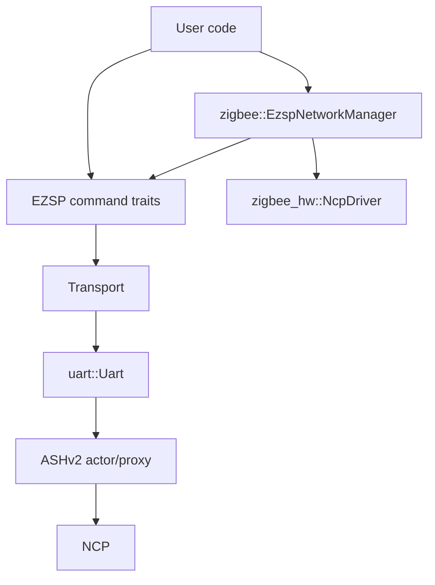

# Architecture

This document describes the current internal architecture of the `ezsp` crate.

## High-level structure

The crate has three layers:

1. Core EZSP layer (always enabled)
   - typed EZSP command traits
   - frame/header/parameter model and parsing
   - shared error/result/types
   - transport abstraction (`Transport`)

2. ASHv2 transport layer (`feature = "ashv2"`)
   - concrete serial transport implementation (`uart::Uart`)
   - EZSP-over-ASHv2 encoding/decoding and frame routing

3. Zigbee integration layer (`feature = "zigbee"`)
   - `zigbee_hw` driver integration (`zigbee::EzspNetworkManager`)
   - callback-to-event translation and network startup orchestration

## Core layer

### Public API shape

`src/lib.rs` re-exports the primary API:

- command traits: `Configuration`, `Messaging`, `Networking`, `Security`, `Utilities`, ...
- convenience super-trait: `Ezsp`
- transport trait: `Transport`
- frame model: `Frame`, `Header`, `Parameters`, `Response`, `Callback`, ...
- extension traits: `ConfigurationExt`, `PolicyExt`, `Displayable`
- core error/result types

### Transport-first design

Command traits are blanket-implemented for any `T: Transport`.

`Transport` provides:

- `connect()`
- `state()`
- `negotiated_version()`
- `send(command)`
- `receive::<R>()`
- default helpers:
  - `ensure_connection()`
  - `communicate(command)`

Each typed command method builds a parameter struct and calls `communicate(...)`.

### `Ezsp` super-trait

`Ezsp` in this crate is a convenience trait that combines all command traits.
It does not add lifecycle methods beyond those provided by `Transport`.

### Frame/parameter model

The frame subsystem (`src/frame`) handles typed parsing and conversion:

- headers: legacy (3-byte) and extended (5-byte)
- payload classification into `Parameters::Response` vs `Parameters::Callback`
- per-command typed conversions via `TryFrom<Parameters>` / `TryInto<_>`

Parameter parsing is ID-driven (`Parameters::parse_from_le_stream(id, ...)`) and maps frame IDs directly to typed response/callback structures.

### Error model

`Error` is the crate-level error type used across command traits and transport code.
It unifies transport I/O, decode failures, status conversion errors, and protocol flow errors.

## ASHv2 transport (`feature = "ashv2"`)

This layer is implemented in `src/uart`.

### Main components

- `Uart`
  - concrete `Transport` implementation
  - tracks connection state and negotiated protocol version
  - owns response queue and callback splitter task
- `Encoder`
  - serializes EZSP headers/parameters
  - fragments large EZSP payloads into ASHv2 payload chunks
- `Decoder`
  - parses ASHv2 payload chunks back into EZSP frames
  - supports fragmented EZSP frame reassembly across multiple ASHv2 payloads
- `Splitter`
  - routes decoded frames:
    - responses -> response queue
    - async callbacks -> callback queue
    - non-async callbacks -> response queue

### Connection lifecycle

`Transport::ensure_connection()` drives initialization using `Connection` state:

- `Disconnected` -> `connect()`
- `Connected` -> no-op
- `Failed` -> reconnect via `connect()`

`Uart::connect()` negotiates protocol version by issuing `version` commands and updates internal state to `Connected` on success.

### TX path

`Uart::send(command)`:

1. select next EZSP header format (legacy/extended) from negotiated version
2. serialize header + command parameters
3. chunk payload to fit ASHv2 max payload size
4. send chunks via `ashv2::Proxy`

### RX path

A background splitter task continuously:

1. receives ASHv2 payloads
2. decodes/reassembles EZSP frame fragments
3. parses typed parameters from frame ID
4. routes frame contents into response or callback channels

### Response handling strategy

`Uart::receive::<T>()` consumes the response queue and attempts typed conversion.
If conversion fails because the response belongs to a different waiter, it requeues the message after a short grace period using a bounded task pool (`tokio_task_pool::Pool`).

## Zigbee integration (`feature = "zigbee"`)

This layer is implemented in `src/zigbee`.

### Main types

- `zigbee::EzspNetworkManager<T>`
  - wraps EZSP transport and implements `zigbee_hw::NcpDriver`
  - tracks message/APS/transaction sequence counters
  - bridges request/response APIs with callback-driven events
- `Builder<T>` (`src/zigbee/network_manager/builder.rs`)
  - startup/configuration DSL for network bootstrap
  - implements `zigbee_hw::Start`
- `EventHandler`
  - translates EZSP callbacks to `zigbee_hw::Event`

### Trait coupling

`EzspNetworkManager<T>` implements `NcpDriver` when:

- `T: Configuration + Security + Messaging + Networking + Utilities + Send + Sync`

`Builder<T>` implements `Start` when:

- `T: Transport + Sync + 'static`

### Startup flow (`Builder::start`)

`start(endpoints)` performs:

1. endpoint validation
2. callback bridge + event handler spawn
3. concentrator/configuration/policy setup via EZSP commands
4. endpoint registration via `add_endpoint`
5. network init path:
   - reinitialize path: leave network, set initial security, form network
   - normal path: `network_init`
6. wait for network-up event
7. runtime radio and route-request setup
8. spawn `EzspNetworkManager` actor and return `NcpHandle` + event receiver

### Data planes

The Zigbee layer keeps two planes separate:

1. command plane (`NcpDriver` calls -> EZSP commands)
2. event plane (EZSP callbacks -> translated `zigbee_hw::Event` stream)
