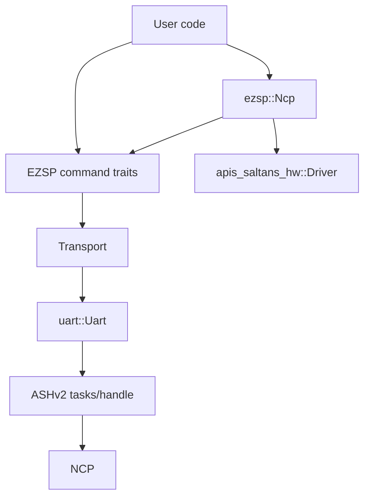
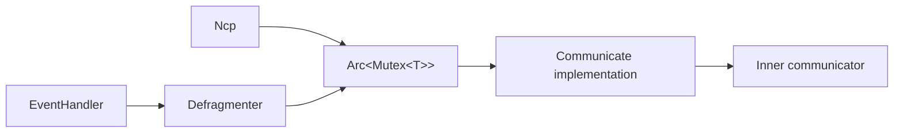
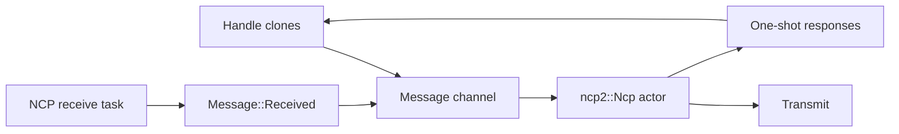
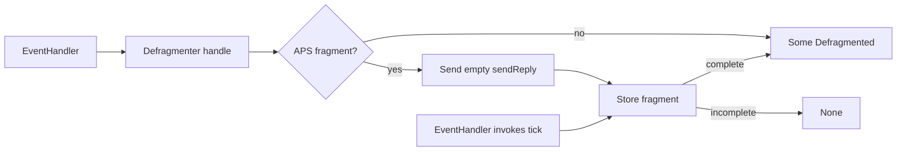

# Architecture

This document describes the current internal architecture of the `ezsp` crate.

## High-level structure

The crate has three layers:

1. Core EZSP layer (always enabled)
   - typed EZSP command traits
   - frame/header/parameter model and parsing
   - shared error/result/types
   - transport abstraction (`Transport`)
   - host-side NCP helper (`Ncp`) and startup builder (`Builder`)

2. ASHv2 transport layer (`feature = "ashv2"`)
   - concrete serial transport implementation (`uart::Uart`)
   - EZSP-over-ASHv2 encoding/decoding and frame routing

3. `apis-saltans` integration layer (`feature = "apis-saltans"`)
   - `apis_saltans_hw` driver integration for `Ncp`
   - custom `Builder` startup orchestration
   - callback-to-event translation, scan aggregation, and network startup orchestration

## Core layer

### Public API shape

`src/lib.rs` re-exports the primary API:

- command traits: `Configuration`, `Messaging`, `Networking`, `Security`, `Utilities`, ...
- convenience super-trait: `Ezsp`
- transport trait: `Transport`
- NCP helper and startup state: `Ncp`, `Builder`, `Startup`,
  `InitializationParameters`, `NetworkCredentials`, `Message`, `Scans`,
  `StackResponse`
- frame model: `Frame`, `Header`, `Parameters`, `Response`, `Callback`, ...
- extension traits: `ConfigurationExt`, `PolicyExt`, `Displayable`
- core error/result types
- protocol data modules under `ember` and `ezsp`

### Transport and communication traits

`Transport` provides the low-level connection and frame operations:

- `connect()`
- `state()`
- `negotiated_version()`
- `send(command)`
- `receive::<R>()`

`Communicate` provides the high-level helpers:

- `ensure_connection()`
- `communicate(command)`

Every `T: Transport` receives a blanket `Communicate` implementation. Command
traits are blanket-implemented for any `T: Communicate`, keeping typed commands
dependent on the command/response transaction rather than the raw transport.

Each typed command method builds a parameter struct and calls `communicate(...)`.

### `Ezsp` super-trait

`Ezsp` in this crate is a convenience trait that combines all command traits.
It does not add lifecycle methods beyond those provided by `Communicate`.

### NCP helper

`Ncp<T>` owns a communicator and provides operations that require callback
correlation or local sequence state:

- active network scans and energy scans, resolved from `networkFound`,
  `energyScanResult`, and `scanComplete` callbacks
- neighbor table collection
- unicast, multicast, and broadcast APS sends that return a `StackResponse` for
  the matching asynchronous `messageSent` callback
- source endpoint selection for outgoing APS frames from configured local
  endpoint output clusters
- message tag and APS sequence counters
- background event-handler termination through `Ncp::terminate()`

`Communicate` is implemented for `Arc<tokio::sync::Mutex<T>>` whenever `T`
implements `Communicate`. Each EZSP command holds the mutex across its complete
command/response transaction, then releases it before the returned
`StackResponse` is awaited. During `apis-saltans` startup, the builder connects
the transport,
wraps it in the shared mutex, and gives clones to `Ncp` and `EventHandler`.
The event handler passes its clone to `Defragmenter`, allowing these components
to serialize access without holding the lock during callback correlation.

The helper stores one output-cluster set keyed by each registered local endpoint
number. Before sending an APS frame, it searches those records in ascending
endpoint-number order and uses the first endpoint whose set contains the
requested cluster ID. If no endpoint advertises the cluster, the helper returns
`Error::NoMatchingSourceEndpoint` before issuing the EZSP send command.

`Builder<T>` stores startup configuration for an `Ncp`: the required `Startup`
mode, EZSP policy and configuration values, concentrator parameters, APS
options, radio power, and buffer sizes. Network formation values are grouped in
the `InitializationParameters` carried by `Startup::Initialize`. Its
`NetworkCredentials` value keeps the extended PAN ID, PAN ID, trust-center
EUI-64, and network key together, while the initialization parameters add the
preconfigured link key, channel, and join method.

### Actor-based NCP (`ncp2`)

The experimental `ncp2` module separates transport transmission from inbound
frame delivery. `Ncp<T>` owns a `T: Transmit`, while cloneable `Handle` values
send typed actor messages through a Tokio MPSC channel. A receive task using
the `Receive` trait forwards raw `Parameters` as `Message::Received` values.

The actor permits one EZSP command at a time and queues later commands until
the current response arrives. This matches the ordered EZSP command/response
exchange and lets each handle method resolve through its own one-shot response
channel.

### Frame/parameter model

The frame subsystem (`src/frame`) handles typed parsing and conversion:

- headers: legacy (3-byte) and extended (5-byte)
- payload classification into `Parameters::Response` vs `Parameters::Callback`
- per-command typed conversions via `TryFrom<Parameters>` / `TryInto<_>`

Parameter parsing is ID-driven (`Parameters::parse_from_le_stream(id, ...)`) and maps frame IDs directly to typed response/callback structures. Command and callback families live under `src/frame/parameters`, while the public command traits live under `src/commands`.

### Error model

`Error` is the crate-level error type used across command traits and transport code.
It unifies transport I/O, decode failures, status conversion errors, and protocol flow errors.

## ASHv2 transport (`feature = "ashv2"`)

This layer is implemented in `src/uart`.
The module re-exports the ASHv2 types and helpers used by its public API:
`Handle`, `Payload`, `SerialPort`, `FlowControl`, `NativeSerialPort`, `open`,
and `start`.

### Main components

- `Uart`
  - concrete `Transport` implementation
  - tracks connection state and negotiated protocol version
  - owns response queue state and returns a caller-driven splitter future
- `uart::Futures`
  - groups the serial worker, ASHv2 transmitter, ASHv2 receiver, and EZSP frame
    splitter futures
  - must be spawned or otherwise polled by the application for the UART link to
    make progress
- re-exported ASHv2 integration surface
  - `uart::SerialPort` bounds custom serial port implementations
  - `uart::FlowControl` configures native serial ports opened by `uart::open`
  - `uart::Handle` and `uart::Payload` support advanced
    integrations that start the ASHv2 link separately
- `Encoder`
  - serializes EZSP headers/parameters
  - sends each EZSP frame as one ASHv2 DATA payload
- `Decoder`
  - parses each ASHv2 DATA payload as one EZSP frame
- `Splitter`
  - routes decoded frames:
    - responses -> response queue
    - async callbacks -> callback queue
    - non-async callbacks -> response queue
  - returns `std::io::Result<()>` when run, reporting closed destination
    channels as errors

### Connection lifecycle

`Communicate::ensure_connection()` drives initialization using `Connection`
state:

- `Disconnected` -> `connect()`
- `Connected` -> no-op
- `Failed` -> reconnect via `connect()`

`Uart::connect()` negotiates protocol version by issuing `version` commands and updates internal state to `Connected` on success. The negotiated version is shared with the decoder so it can parse legacy and extended headers correctly.

### TX path

`Uart::send(command)`:

1. select next EZSP header format (legacy/extended) from negotiated version
2. serialize header + command parameters
3. send the complete EZSP frame as one ASHv2 DATA payload via the `uart::Handle`
   re-exported from the ASHv2 layer

EZSP has no protocol-level fragmentation and ASHv2 does not fragment EZSP DATA
payloads. If the serialized EZSP frame does not fit in one ASHv2 DATA payload,
encoding fails before anything is sent.

### APS fragment reassembly

`Defragmenter<T>` provides APS-level reassembly for a messaging transport. It
follows the EZSP host fragmentation model: packets are keyed by sender and APS
sequence, fragments are accepted within the configured fragment window, every
fragment triggers an empty `sendReply`, and incomplete packets are removed by
a timeout tick. The optional `apis-saltans` event actor owns a defragmenter,
ticks it before handling incoming APS callbacks, and only translates complete
messages into events.

### Runtime futures

`Uart::open` and `Uart::from_serial_port` return `(Uart, callbacks, Futures<_>)`.
The caller owns the returned futures and must run them on an executor:

1. `serial_worker` owns the blocking serial port and services async read/write
   requests.
2. `ash_transmitter` sends outbound ASHv2 frames.
3. `ash_receiver` receives inbound ASHv2 frames and forwards DATA payloads.
4. `frame_splitter` decodes EZSP frames and routes them into response or
   callback channels, resolving with `std::io::Result<()>`.

`Uart::new` is the advanced constructor for callers that already created an
ASHv2 `Handle` and inbound `Payload` stream. It returns `(Uart, splitter)`, and
the caller is still responsible for running the ASHv2 futures from its own setup.
The splitter future reports closed response or callback channels as
`std::io::Result` errors.

### RX path

The frame splitter future continuously:

1. receives ASHv2 payloads
2. decodes one EZSP frame from each ASHv2 DATA payload
3. parses typed parameters from frame ID
4. routes frame contents into response or callback channels

### Response handling strategy

`Uart::receive::<T>()` consumes the response queue and attempts typed conversion.
If conversion fails because the response belongs to a different waiter, it
requeues the message on the response channel.

## `apis-saltans` integration (`feature = "apis-saltans"`)

This layer is implemented in `src/apis_saltans`.

### Main types

- `Ncp<T>`
  - owns its communicator; the standard startup path supplies `Arc<Mutex<T>>`
  - implements `apis_saltans_hw::Driver` when the feature is enabled
  - tracks message tag and APS sequence counters
  - bridges request/response APIs with callback-driven events
- `Builder<T>` (`src/ncp/builder.rs`)
  - startup/configuration DSL for network bootstrap
  - owns the required `Startup` mode for resume or explicit network formation
  - provides custom `start` helpers for `apis-saltans` NCP startup
- `InitializationParameters` (`src/ncp/initialization_parameters.rs`)
  - combines network credentials with the preconfigured link key, radio
    channel, and join method needed to form a network
  - converts those values into the initial security state and Ember network
    parameters
- `NetworkCredentials` (`src/ncp/network_credentials.rs`)
  - owns the network identifiers, trust-center identity, and network key
  - supports explicit construction or random sampling; callers are responsible
    for using a cryptographically secure RNG
- `EventHandler`
  - translates EZSP callbacks to `apis_saltans_hw::Event`
  - owns a `Defragmenter<T>` sharing the NCP transport and emits only complete incoming APS messages
  - correlates outgoing message tags with `MessageSent` callbacks
  - collects active and energy scan callback streams into one-shot scan responses
- conversion modules (`src/apis_saltans/conversion`)
  - map EZSP structures into `apis-saltans` address, APS data, event, found-network, and scanned-channel types
  - convert `apis_saltans_zdp::SimpleDescriptor` endpoint cluster lists into
    the EZSP cluster metadata stored by `Ncp`
  - convert `ChildJoin`, `StackStatus`, and `TrustCenterJoin` callbacks into join/leave/rejoin/network events

### Trait coupling

`Ncp<T>` implements `Driver` when:

- `T: Messaging + Networking + Utilities + Send + Sync`

`Builder::start` is available when:

- `T: Communicate + Configuration + Security + Messaging + Networking + Utilities + Send + Sync + 'static`

When `ashv2` is also enabled, `Ncp<uart::Uart>` exposes an
`ashv2(serial_port, startup)` convenience constructor for serial ports
implementing `uart::SerialPort`. The builder also has an ASHv2 helper that
accepts a `Startup` value and explicit `uart::Buffers`. Both constructors return
`uart::Futures` that the caller must run alongside the NCP.

### Startup flow (`Builder::start`)

`start(endpoints)` performs:

1. endpoint validation
2. callback bridge + event handler spawn
3. concentrator/configuration/policy setup via EZSP commands
4. endpoint registration via `add_endpoint`
5. current IEEE address and network state lookup
6. apply the selected `Startup` path:
   - `Startup::Initialize(parameters)`: leave the current network, install the
     credentials' network key and trust-center identity together with the
     parameters' preconfigured link key, then form the configured network
   - `Startup::Resume(bitmask)`: pass the bitmask to `network_init` to restore
     persisted network state
7. wait for network-up event
8. runtime radio power, state logging, and many-to-one route-request setup
9. spawn the `Ncp` actor and return `NcpHandle` + event receiver

Builder configuration includes policy values, configuration values,
concentrator parameters, APS options, radio transmit power, a required `Startup`
mode, and channel buffer size. Requiring `Startup` at construction makes the
potentially destructive network-formation path explicit. Network formation
values are kept together in `InitializationParameters`; reusable network
identity and key material are nested in `NetworkCredentials` rather than
configured through independent builder setters.

The same `SimpleDescriptor` list used for `add_endpoint` is converted into
`Clusters` and stored in the resulting `Ncp`. That stored metadata is not used
for incoming event translation; it is used by the outgoing APS helpers to choose
the local source endpoint for each cluster ID.

### Data planes

The `apis-saltans` layer keeps three planes separate:

1. command plane (`NcpDriver` calls -> EZSP commands)
2. response-correlation plane (message tags -> `MessageSent` one-shot responses)
3. event plane (EZSP callbacks -> translated `apis_saltans_hw::Event` stream)

For outgoing `NcpDriver` APS sends, the adapter takes the profile and cluster
from `apis_saltans_hw::Frame` metadata. Unicast sends pass through the requested
destination endpoint; multicast and broadcast sends use the profile's broadcast
endpoint. Unicast sends are single-target operations; fan-out is represented as
multiple unicast requests. Source endpoint selection remains centralized in
`Ncp`.

`Ncp::terminate()` sends a termination message to the event handler and returns
the underlying transport after the handler task exits.
