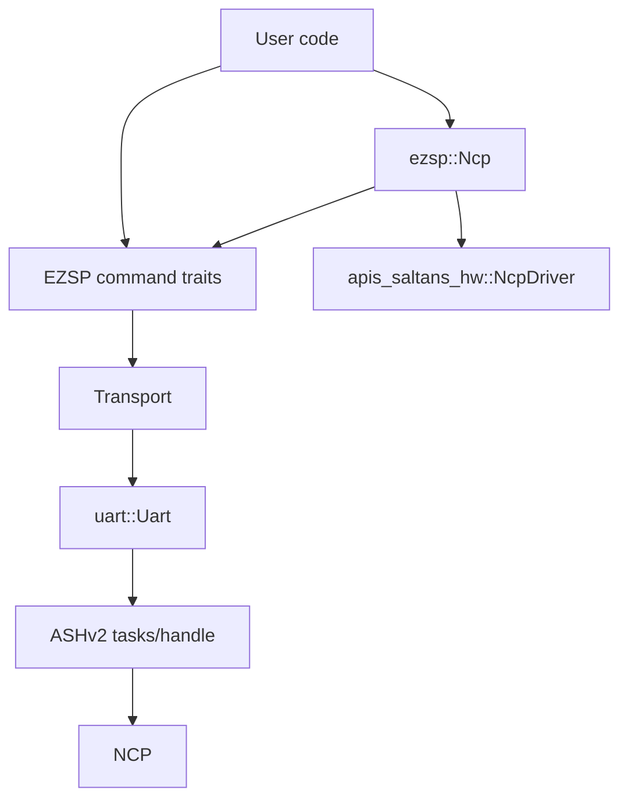

# Architecture

This document describes the current internal architecture of the `ezsp` crate.

## High-level structure

The crate has three layers:

1. Core EZSP layer (always enabled)
   - typed EZSP command traits
   - frame/header/parameter model and parsing
   - shared error/result/types
   - transport abstraction (`Transport`)
   - host-side NCP helper (`Ncp`) and startup builder (`Builder`)

2. ASHv2 transport layer (`feature = "ashv2"`)
   - concrete serial transport implementation (`uart::Uart`)
   - EZSP-over-ASHv2 encoding/decoding and frame routing

3. `apis-saltans` integration layer (`feature = "apis-saltans"`)
   - `apis_saltans_hw` driver integration for `Ncp` and `Builder`
   - callback-to-event translation, scan aggregation, and network startup orchestration

## Core layer

### Public API shape

`src/lib.rs` re-exports the primary API:

- command traits: `Configuration`, `Messaging`, `Networking`, `Security`, `Utilities`, ...
- convenience super-trait: `Ezsp`
- transport trait: `Transport`
- NCP helper and startup state: `Ncp`, `Builder`, `Message`, `Scans`
- frame model: `Frame`, `Header`, `Parameters`, `Response`, `Callback`, ...
- extension traits: `ConfigurationExt`, `PolicyExt`, `Displayable`
- core error/result types
- protocol data modules under `ember` and `ezsp`

### Transport-first design

Command traits are blanket-implemented for any `T: Transport`.

`Transport` provides:

- `connect()`
- `state()`
- `negotiated_version()`
- `send(command)`
- `receive::<R>()`
- default helpers:
  - `ensure_connection()`
  - `communicate(command)`

Each typed command method builds a parameter struct and calls `communicate(...)`.

### `Ezsp` super-trait

`Ezsp` in this crate is a convenience trait that combines all command traits.
It does not add lifecycle methods beyond those provided by `Transport`.

### NCP helper

`Ncp<T>` wraps an EZSP transport and provides operations that require callback
correlation or local sequence state:

- active network scans and energy scans, resolved from `networkFound`,
  `energyScanResult`, and `scanComplete` callbacks
- neighbor table collection
- unicast and multicast APS sends, resolved by awaiting the matching
  `messageSent` callback
- broadcast APS sends with status validation
- source endpoint selection for outgoing APS frames from configured local
  endpoint output clusters
- message tag and APS sequence counters
- background event-handler termination through `Ncp::terminate()`

`Ncp<T>` dereferences to `T`, so callers can still use all command traits on the
underlying transport.

The helper stores one cluster-list record per local endpoint. Before sending an
APS frame, it searches those records for the first endpoint whose output cluster
list contains the requested cluster ID and uses that one-based endpoint number
as the APS source endpoint. If no endpoint advertises the cluster, the helper
returns `Error::NoMatchingSourceEndpoint` before issuing the EZSP send command.

`Builder<T>` stores startup configuration for an `Ncp`: EZSP policy and
configuration values, concentrator parameters, APS options, link and network
keys, join method, PAN ID, extended PAN ID, radio channel, radio power,
reinitialization mode, and buffer sizes.

### Frame/parameter model

The frame subsystem (`src/frame`) handles typed parsing and conversion:

- headers: legacy (3-byte) and extended (5-byte)
- payload classification into `Parameters::Response` vs `Parameters::Callback`
- per-command typed conversions via `TryFrom<Parameters>` / `TryInto<_>`

Parameter parsing is ID-driven (`Parameters::parse_from_le_stream(id, ...)`) and maps frame IDs directly to typed response/callback structures. Command and callback families live under `src/frame/parameters`, while the public command traits live under `src/commands`.

### Error model

`Error` is the crate-level error type used across command traits and transport code.
It unifies transport I/O, decode failures, status conversion errors, and protocol flow errors.

## ASHv2 transport (`feature = "ashv2"`)

This layer is implemented in `src/uart`.
The module re-exports the ASHv2 types and helpers used by its public API:
`Handle`, `Payload`, `SerialPort`, `FlowControl`, `NativeSerialPort`, `open`,
and `start`.

### Main components

- `Uart`
  - concrete `Transport` implementation
  - tracks connection state and negotiated protocol version
  - owns response queue state and returns a caller-driven splitter future
- `uart::Futures`
  - groups the serial worker, ASHv2 transmitter, ASHv2 receiver, and EZSP frame
    splitter futures
  - must be spawned or otherwise polled by the application for the UART link to
    make progress
- re-exported ASHv2 integration surface
  - `uart::SerialPort` bounds custom serial port implementations
  - `uart::FlowControl` configures native serial ports opened by `uart::open`
  - `uart::Handle` and `uart::Payload` support advanced
    integrations that start the ASHv2 link separately
- `Encoder`
  - serializes EZSP headers/parameters
  - fragments large EZSP payloads into ASHv2 payload chunks
- `Decoder`
  - parses ASHv2 payload chunks back into EZSP frames
  - supports fragmented EZSP frame reassembly across multiple ASHv2 payloads
- `Splitter`
  - routes decoded frames:
    - responses -> response queue
    - async callbacks -> callback queue
    - non-async callbacks -> response queue

### Connection lifecycle

`Transport::ensure_connection()` drives initialization using `Connection` state:

- `Disconnected` -> `connect()`
- `Connected` -> no-op
- `Failed` -> reconnect via `connect()`

`Uart::connect()` negotiates protocol version by issuing `version` commands and updates internal state to `Connected` on success. The negotiated version is shared with the decoder so it can parse legacy and extended headers correctly.

### TX path

`Uart::send(command)`:

1. select next EZSP header format (legacy/extended) from negotiated version
2. serialize header + command parameters
3. chunk payload to fit ASHv2 max payload size
4. send chunks via the `uart::Handle` re-exported from the ASHv2 layer

### Runtime futures

`Uart::open` and `Uart::from_serial_port` return `(Uart, callbacks, Futures<_>)`.
The caller owns the returned futures and must run them on an executor:

1. `serial_worker` owns the blocking serial port and services async read/write
   requests.
2. `ash_transmitter` sends outbound ASHv2 frames.
3. `ash_receiver` receives inbound ASHv2 frames and forwards DATA payloads.
4. `frame_splitter` decodes EZSP frames and routes them into response or
   callback channels.

`Uart::new` is the advanced constructor for callers that already created an
ASHv2 `Handle` and inbound `Payload` stream. It returns `(Uart, splitter)`, and
the caller is still responsible for running the ASHv2 futures from its own setup.

### RX path

The frame splitter future continuously:

1. receives ASHv2 payloads
2. decodes/reassembles EZSP frame fragments
3. parses typed parameters from frame ID
4. routes frame contents into response or callback channels

### Response handling strategy

`Uart::receive::<T>()` consumes the response queue and attempts typed conversion.
If conversion fails because the response belongs to a different waiter, it
requeues the message on the response channel.

## `apis-saltans` integration (`feature = "apis-saltans"`)

This layer is implemented in `src/apis_saltans`.

### Main types

- `Ncp<T>`
  - wraps EZSP transport
  - implements `apis_saltans_hw::NcpDriver` when the feature is enabled
  - tracks message tag and APS sequence counters
  - bridges request/response APIs with callback-driven events
- `Builder<T>` (`src/ncp/builder.rs`)
  - startup/configuration DSL for network bootstrap
  - implements `apis_saltans_hw::Start`
- `EventHandler`
  - translates EZSP callbacks to `apis_saltans_hw::Event`
  - correlates outgoing message tags with `MessageSent` callbacks
  - collects active and energy scan callback streams into one-shot scan responses
- conversion modules (`src/apis_saltans/conversion`)
  - map EZSP structures into `apis-saltans` address, APS data, event, found-network, and scanned-channel types
  - convert `apis_saltans_zdp::SimpleDescriptor` endpoint cluster lists into
    the EZSP cluster metadata stored by `Ncp`
  - convert `ChildJoin`, `StackStatus`, and `TrustCenterJoin` callbacks into join/leave/rejoin/network events

### Trait coupling

`Ncp<T>` implements `NcpDriver` when:

- `T: Configuration + Security + Messaging + Networking + Utilities + Send + Sync`

`Builder<T>` implements `Start` when:

- `T: Transport + Sync + 'static`

When `ashv2` is also enabled, `Ncp<uart::Uart>` exposes an
`ashv2(serial_port)` convenience constructor for serial ports implementing
`uart::SerialPort`. The builder also has an ASHv2 helper that accepts explicit
`uart::Buffers`. Both constructors return `uart::Futures` that the caller must
run alongside the NCP.

### Startup flow (`Builder::start`)

`start(endpoints)` performs:

1. endpoint validation
2. callback bridge + event handler spawn
3. concentrator/configuration/policy setup via EZSP commands
4. endpoint registration via `add_endpoint`
5. current IEEE address and network state lookup
6. network init path:
   - reinitialize path: leave network, set initial security, form network
   - normal path: `network_init`
7. wait for network-up event
8. runtime radio power, state logging, and many-to-one route-request setup
9. spawn the `Ncp` actor and return `NcpHandle` + event receiver

Builder configuration includes policy values, configuration values, concentrator parameters, APS options, link/network keys, join method, PAN ID, IEEE address, radio channel, radio power, reinitialization mode, and channel buffer size.

The same `SimpleDescriptor` list used for `add_endpoint` is converted into
`Clusters` and stored in the resulting `Ncp`. That stored metadata is not used
for incoming event translation; it is used by the outgoing APS helpers to choose
the local source endpoint for each cluster ID.

### Data planes

The `apis-saltans` layer keeps three planes separate:

1. command plane (`NcpDriver` calls -> EZSP commands)
2. response-correlation plane (message tags -> `MessageSent` one-shot responses)
3. event plane (EZSP callbacks -> translated `apis_saltans_hw::Event` stream)

For outgoing `NcpDriver` APS sends, the adapter takes the profile and cluster
from `apis_saltans_hw::Frame` metadata. Unicast sends pass through the requested
destination endpoint; multicast and broadcast sends use the profile's broadcast
endpoint. Unicast sends are single-target operations; fan-out is represented as
multiple unicast requests. Source endpoint selection remains centralized in
`Ncp`.

`Ncp::terminate()` sends a termination message to the event handler and returns
the underlying transport after the handler task exits.
