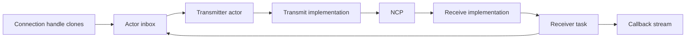

# ezsp

Actor-based host support for the EmberZNet Serial Protocol (EZSP).

EZSP is the command protocol used by a host application processor to control
the EmberZNet PRO stack running on a Silicon Labs Network Co-Processor (NCP).
This crate models typed command, response, and callback payloads; legacy and
extended frame headers; transport-independent actors; high-level Zigbee
workflows; and a transport API that external link implementations, including
ASHv2, can use.

## Documentation basis

The protocol model follows these Silicon Labs references:

- `UG100: EZSP Reference Guide`, Rev. 5.1, for EmberZNet PRO 7.4.2.
- `UG101: UART-EZSP Gateway Protocol Reference`, Rev. 1.3, for ASHv2 over UART.
- <https://docs.silabs.com/zigbee/latest/sisdk-ezsp-reference-guide/>, the
  current Simplicity SDK EZSP reference.
- <https://docs.silabs.com/zigbee/6.6/em35x/>, the older EmberZNet API
  reference used by several Ember type descriptions.

The implementation retains the legacy EZSP and Ember names where they are part
of the crate API.

## Features

- `apis-saltans` implements `apis_saltans_hw::Driver` for `Ncp` and supplies
  callback/event and data-model conversions.
- `semver` enables `semver` support in EZSP version APIs.

This crate does not depend on, re-export, or provide an implementation of
ASHv2. An ASHv2 crate can integrate by implementing the public `Transmit` and
`Receive` traits.

## Actor model

The transport API separates outbound and inbound I/O:

- `Transmit` sends a complete `Frame<Commands>`.
- `Receive` yields decoded `Frame<Parameters>` values and accepts the negotiated
  EZSP version used by version-sensitive decoders.
- `Client::run` is an associated constructor that wraps those transport halves
  and returns a newly wired `Client` plus `Futures` for the caller to spawn.
- `Futures` is exported from the crate root and contains the transmitter and
  receiver actor futures.
- The returned `Client` represents the actor channels before protocol
  negotiation.
- `Client::connect` sends the initial `version` command and returns a
  cloneable `Connection` handle together with the asynchronous callback stream.
- `Connection` implements `Communicate`; all EZSP command-group traits are
  blanket-implemented for communicators.

Every `Connection::communicate` call sends an actor message and waits on its own
one-shot response. The transmitter actor assigns an EZSP sequence number,
serializes outbound access, and correlates inbound responses by that number.
Cloned handles can therefore be used by independent tasks without placing the
transport behind a mutex. Asynchronous callbacks bypass response correlation
and are delivered through a separate bounded channel.



Transport implementations supply independent `Transmit` and `Receive` halves.
Pass both halves to `Client::run` and spawn both returned actor futures before
version negotiation. The transport implementation remains responsible for
running any lower-level I/O tasks that feed those halves.

## Typed protocol API

EZSP command methods are grouped into traits such as `Configuration`,
`Messaging`, `Networking`, `Security`, and `Utilities`. Each method creates a
typed command parameter, calls `Communicate::communicate`, and converts the
correlated response into its public return type. `Ezsp` is a convenience trait
combining the complete command surface.

The lower-level frame model remains public for transport implementations and
protocol tooling:

- `Frame`, `Header`, `Legacy`, and `Extended` model the EZSP envelope.
- `Commands` is the outbound aggregate consumed by `Transmit` implementations.
- `Parameters`, `Response`, and `Callback` classify decoded inbound payloads.
- `Parsable` performs frame-ID-directed parameter decoding, while the public
  `Decode`, `Status`, and `Error` types let adapters report compatible failures.
- Protocol data types are exposed through `ember`, `ezsp`, and the typed
  parameter modules.

EZSP fields wider than one byte are encoded little-endian. Protocol versions
before 8 use the three-byte legacy header; versions 8 and newer use the
five-byte extended header. The generic receiver actor records a successful
`version` response and passes the negotiated version to subsequent transport
receive calls.

## High-level NCP startup

`Builder` owns a pre-negotiation `Client` and the complete startup
configuration. The associated function `Client::run` creates that client and
returns it together with the `Futures` that drive it. After the caller spawns
those futures, `start`:

1. validates that at least one application endpoint was supplied;
2. negotiates the requested EZSP version through the running transport actors;
3. applies concentrator, configuration, and policy settings;
4. resumes the persisted network or forms an explicitly configured network;
5. waits for `NetworkUp`, applies runtime radio power, and sends a many-to-one
   route request;
6. registers the supplied endpoints;
7. creates the callback bridge and event-handler futures used for translation,
   scan aggregation, APS defragmentation, and message-confirmation correlation;
8. returns those futures with `Ncp` in a `BuildResult`.

`Builder::start` does not spawn either returned future. Spawn `bridge` before
`event_handler`, and keep both tasks running while using the `Ncp`.

The event channel passed to `Builder::start` determines the application event
type. That type must implement `TranslatableEvent`, which is automatically
implemented for types that can be constructed from both `Callback` and
`DefragmentedMessage`.

Builder methods configure callback and actor channel capacities, the desired
protocol version, EZSP policies and configuration values, concentrator
parameters, radio transmit power, and baseline APS options. The named APS
option methods enable route discovery, forced route discovery, source or
destination EUI-64 inclusion, and address discovery for every outgoing frame.
Per-message options supplied to the send methods are combined with this
baseline.

`Startup::Resume` restores state persisted by the NCP through `networkInit` and
is the normal choice for restarts:

```rust
use ezsp::Startup;
use ezsp::ezsp::network::InitBitmask;

let startup = Startup::Resume(InitBitmask::NO_OPTIONS);
```

`Startup::Initialize` intentionally replaces the current network. It attempts
to leave the current network, installs the initial security state, and forms a
network from `InitializationParameters`. `NetworkCredentials` groups the
extended PAN ID, PAN ID, trust-center EUI-64, and network key; initialization
parameters add the preconfigured trust-center link key, channel, join method,
and initial security bitmask.

```rust
use ezsp::{InitializationParameters, NetworkCredentials, Startup};

let credentials = NetworkCredentials::new(
    extended_pan_id,
    pan_id,
    trust_center_eui64,
    network_key,
);
let parameters = InitializationParameters::new(
    credentials,
    link_key,
    radio_channel,
    join_method,
    security_bitmask,
);
let startup = Startup::Initialize(parameters);
```

`NetworkCredentials` contains secret key material. Do not log its `Debug`
output, and protect persisted or copied credentials appropriately. Random
credentials can be sampled with `rand`, but the distribution accepts any RNG;
production callers are responsible for selecting a cryptographically secure
one.

## High-level NCP operations

`Ncp` owns the connected communicator and endpoint metadata. It adds
workflows that span commands and asynchronous callbacks:

- active-network and energy scans, completed by `scanComplete`;
- unicast, multicast, and broadcast APS sends;
- outgoing message-tag correlation with `messageSent` callbacks;
- incoming APS fragment reassembly;
- source-endpoint selection from registered output clusters; and
- event-handler shutdown through `Ncp::terminate`.

Outgoing APS sends select the lowest-numbered registered local endpoint whose
output clusters contain the requested cluster ID. ZDP uses endpoint zero. A
missing match returns `Error::NoMatchingSourceEndpoint` before a send command is
issued.

Awaiting `Ncp::unicast`, `Ncp::multicast`, or `Ncp::broadcast` performs the EZSP
send transaction and returns a deferred `StackResponse` (multicast also returns
the assigned APS sequence). Await `StackResponse` separately to validate the
matching asynchronous `messageSent` callback. Dropping it discards only the
notification and does not cancel a message already accepted by the NCP.

Each send method takes a final `aps_options: ember::aps::Options` argument.
These per-message options are combined with the options configured on
`Builder`; pass `Options::NONE` when a message needs no additional flags. For
example, a caller can request APS encryption and retry for one unicast without
changing the baseline used by later sends:

```rust
use ezsp::ember::aps::Options;

let options = Options::ENCRYPTION.union(Options::RETRY);
let response = ncp
    .unicast(
        short_id,
        profile_id,
        cluster_id,
        destination_endpoint,
        payload,
        options,
    )
    .await?;
response.await?;
```

Oversized unicasts are split into APS fragments. Multicast and broadcast
payloads must fit the maximum payload reported by the NCP. Fragmented unicasts
enable APS retry in addition to the combined baseline and per-message options.

## APS defragmentation

`Defragmenter<T>` reassembles fragmented incoming APS unicasts for any
`T: Messaging`. `handle` acknowledges each fragment with the required empty
`sendReply` and returns a `DefragmentedMessage` after the complete payload is
available. The high-level event handler owns a defragmenter using its clone of
the `Connection` actor handle and emits incoming-message events only for complete
payloads.

Reassembly keys messages by sender and APS sequence, enforces the fragment
window and receive-buffer limits, and expires incomplete messages. Compile-time
environment variables can override the defaults:

- `EZSP_DEFRAGMENTATION_MAX_INCOMING_PACKETS`
- `EZSP_DEFRAGMENTATION_DEFAULT_WINDOW_SIZE`
- `EZSP_DEFRAGMENTATION_RECEIVE_BUFFER_LENGTH`
- `EZSP_DEFRAGMENTATION_REASSEMBLY_TIMEOUT_MILLIS`

## External ASHv2 integration

ASHv2 support lives outside this crate. An adapter supplies an outbound type
implementing `Transmit` and an inbound type implementing `Receive`:

- `Transmit::transmit` receives a complete typed `Frame<Commands>`. An ASHv2
  adapter serializes the header followed by the command parameters in
  little-endian order and sends the result as one ASHv2 DATA payload.
- `Receive::receive` accepts the currently negotiated version and obtains one
  complete ASHv2 DATA payload, decodes its EZSP header and parameters, and
  returns `Frame<Parameters>`. It receives `None` before the initial EZSP
  `version` response and `Some(version)` on subsequent calls; versions at least
  `MIN_NON_LEGACY_VERSION` use extended headers. Because this method returns
  `Option` rather than `Result`, the adapter owns its malformed-frame policy,
  such as logging and skipping a bad payload.

Once the ASHv2-specific halves exist, the generic EZSP wiring is:

```rust
use ezsp::{Builder, Client};

const EZSP_CHANNEL_SIZE: usize = 128;

// `ash_transmit` and `ash_receive` are supplied by an external ASHv2 adapter
// and implement `ezsp::Transmit` and `ezsp::Receive`, respectively.
let (client, futures) =
    Client::run(ash_transmit, ash_receive, EZSP_CHANNEL_SIZE);

let _ezsp_transmitter = tokio::spawn(futures.transmitter);
let _ezsp_receiver = tokio::spawn(futures.receiver);

let result = Builder::new(client)
    .start(startup, endpoints, event_sender)
    .await?;

// Spawn the returned application services in producer-to-consumer order.
let _bridge = tokio::spawn(result.bridge);
let _event_handler = tokio::spawn(result.event_handler);
let ncp = result.ncp;
```

Start any lower-level ASHv2 serial worker and ASHv2 protocol tasks before the
two EZSP actor futures. Both EZSP actors must be running before
`Builder::start`, because startup begins with `Client::connect`. The
`channel_size` passed to `Client::run` bounds the EZSP command/response and
callback channels. `Builder::with_event_messages_capacity` configures the
separate channel between the callback bridge and event handler.

ASHv2 remains responsible for reliability, CRC validation, byte stuffing,
randomization, acknowledgements, reset handling, and retransmission. Neither
EZSP nor ASHv2 fragments protocol frames: one complete EZSP frame must fit in
one ASHv2 DATA payload.

## `apis-saltans` integration

The `apis-saltans` feature adds implementations and conversions around the
normal actor-backed `Ncp`; it does not add a wrapper type or another transport.

`Ncp` implements `apis_saltans_hw::Driver`. The mapping provides:

- stored endpoint descriptors through `Driver::get_endpoints`;
- NCP identity and EZSP address-table lookup operations;
- active-network and energy scans through the existing callback aggregator;
- permit joining, with the requested duration truncated to whole seconds and
  clamped to 255 seconds;
- high-RAM many-to-one route requests; and
- unicast, broadcast, and multicast datagram transmission through the
  high-level NCP send helpers.

After extracting `Ncp` from the `BuildResult`, call `Driver::run` and spawn its
returned future to run the separate `apis-saltans` hardware actor:

```rust
use apis_saltans_hw::Driver;

let (hardware, driver) = ncp.run(64);
tokio::spawn(driver);

// `hardware` is an apis_saltans_hw::NcpHandle.
```

The feature provides bidirectional endpoint conversion. Convert the ZDP simple
descriptors used by `apis-saltans` before passing them to the EZSP builder:

```rust
let endpoints: Box<[ezsp::Endpoint]> = simple_descriptors
    .into_iter()
    .map(Into::into)
    .collect();
```

`Driver::get_endpoints` performs the reverse conversion. Endpoints containing
an unsupported `apis-saltans` profile or a reserved endpoint number are logged
and omitted; descriptors originally converted from `SimpleDescriptor` round
trip without that loss.

Outgoing datagrams take their APS profile and cluster from
`apis_saltans_hw::Datagram` metadata. A device destination preserves its target
endpoint. A broadcast uses its target endpoint with radius zero. A group uses
the profile's broadcast endpoint with zero multicast hops and nonmember radius.
The local source endpoint is still selected from the registered EZSP output
clusters.

The integration also maps per-datagram transmission options into EZSP APS
options: `ACKNOWLEDGED_TRANSMISSION` controls `Options::RETRY`, and
`SECURITY_ENABLED` controls `Options::ENCRYPTION`. Those values are then
combined with the NCP's baseline options. Other `TxOptions` flags do not add an
EZSP APS option.

`Driver::transmit` returns `HwResponse` after the EZSP send transaction has been
accepted. The response contains the deferred `StackResponse`; awaiting it
reports the later `messageSent` callback status.

### Event and message conversion

The feature converts these EZSP callbacks into `apis_saltans_hw::Event` values:

- `stackStatus` for network up, down, opened, and closed;
- `childJoin` for child joins and leaves; and
- `trustCenterJoin` for unsecured joins, secured/unsecured rejoins, and leaves.

Complete incoming APS messages convert separately into
`apis_saltans_hw::aps::Data<bytes::Bytes>` and NWK envelopes. The conversion
preserves APS destination, profile, cluster, endpoints, sequence, and payload,
plus the sender short ID, link quality, RSSI, binding index, and source-route
overhead. The source IEEE address remains unknown.

The feature does not currently implement
`TryFrom<DefragmentedMessage>` directly for `apis_saltans_hw::Event`. Therefore
that event enum alone does not implement `TranslatableEvent` and cannot be used
as `Builder::start`'s event type without an application wrapper that supplies
both required conversions.

EZSP errors cross the driver boundary as
`apis_saltans_hw::Error::Implementation`, retaining the original error in an
`Arc`.

## Legal

This project is free software and is not affiliated with Silicon Labs. Silicon
Labs documentation is cited only to describe the public protocol implemented by
this crate.

## Contributing

- Format with `cargo +nightly fmt` and verify with
  `cargo +nightly fmt --check`.
- Lint with `cargo clippy --all-features`.
- Verify documentation with `cargo +nightly doc --all-features --no-deps`.
